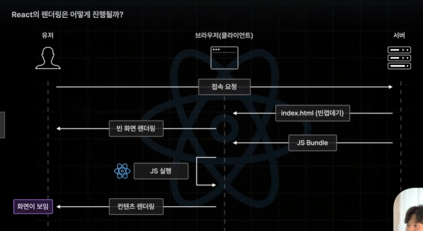

# Next.js 를 소개합니다. 
* 🎈[notion](https://three-handbell-c4f.notion.site/Next-js-14c77f05fb34801e81f5e6c3390f0017?pvs=4)


## 어떤 기술일까?
- React.js 전용 웹 개발 Framework
- React.js 를 보다 더 강력하고 편하게 사용할 수 있는 기능들을 제공함.
    - 페이지 라우팅
    - 빌트인 최적화 기능
    - 다이나믹 HTML 스트리밍
=> React.js의 확장판

## 특징?
- Next.js 는 Library가 아닌 Framework 입니다.
    - 기능 구현의 주도권이 누구에게 있는가에 따라 Library, Framework 가 달라짐.
    
    | 구분              | Framework                                    | Library                   |
    |-------------------|----------------------------------------------|---------------------------|
    | 예시              | Next.js, Remix                               | React.js, JQuery          |
    | 주도권           | 프레임워크 (개발자에게 없음)                 | 개발자에게 있음           |
    | 자유도            | 낮음                                         | 높음                      |
    | 추가 도구 사용    | 프레임워크가 허용하는 범위 내에서만 사용 가능 | 원하는 도구 및 기술 사용 가능 |
    | 기본 제공 기능    | 거의 모든 기능 제공                           | 기본 기능 외 별도 제공 없음 |
    | 기능 예시         | Page Routing, Optimizations, Server Pre-Rendering | 기능 구현 방향 개발자 설정 가능 |
    
    


# 사전 렌더링 이해하기
## 사전 렌더링 
- 브라우저의 요청에 사전에 렌더링이 완료된 HTML 을 응답하는 렌더링 방식
- Client Side Rendering 의 단점을 효율적으로 해결하는 기술


## Client Side Rendering(CSR)
- React.js 앱의 기본적인 렌더링 방식
- 클라이언트(브라우저)에서 직접 화면을 렌더링하는 방식
> * 장점 :  페이지 이동이 매우 빠르고 쾌적하다는 장점이 있음.   
> * 단점 : FCP (초기 접속 속도) 가 느림.   

-> 클라이언트가 필요로하는 전체코드를 JS Bundle Client 에게 제공해주고  Client 에서 페이지 이동이 발생하면 Js를 실행하여 화면을 업데이트 해줌.   
  

### FCP(First Contentful Paint)
- "요청 시작" 시점부터 컨텐츠가 화면에 처음 나타나는데 걸리는 시간
요청시작 <--> 컨텐츠 렌더링


# React 의 문제점을 해결하는 Next.js 의 사전렌더링
   
초기렌더링엔 상호작용이 불가능한 HTML 을 화면에 렌더링 후에   
> * JS 실행(렌더링) : 자바스크립트 코드(React 컴포넌트)를 HTML 로 변환하는 과정
> * 화면에 렌더링 : HTML  코드를 브라우저가 화면에 그려내는 과정.

바로 연속해서 서버가 JS Bundle 된 코드를 전달해주고 클라이언트는 HTML 과 해당 소스를 연결하여 상호작용이 가능한 HTML 을 만든다.    
-> 이처럼 언터렉션(상호작용)이 불가한 코드에 Javascript 코드를 추가해주어 
인터렉션이 가능한 화면이되는 것을 빗대어 **수화(Hydration)**라고 말한다.
   
> TTI : Time To Interative

### Next.js 
- 사전 렌더링(Pre-Rendering) 
``` 
     React App 의 단점 해소 + React App 의 장점 승계
        빠른 FCP 달성              빠른 페이지 이동
```


# 실습용 벡엔드 서버 기동하기
- supabase - signup - project create
- datasource url 복사 후 벡엔드 서버 소스에 .env 파일 생성해서 붙여넣어줌.
- 백엔드 서버 초기 세팅   
  - npm install - 의존성 모듈 설치   
  - npx prisma db push - db 초기화    
  - npm run seed  - db 초기 데이터 생성   
  - npm run build - 벡엔드 서버 빌드   
  - npm run start - 벡엔드 서버 기동   
  - npx prisma studio - db 데이터 조회 UI

- superbase 1주일 접속안할시 중지됨    
이때 재기동 방법은 dashboard 들어가서 만든 프로젝트 들어가보면
** Restore Project ** 버튼 클릭 
