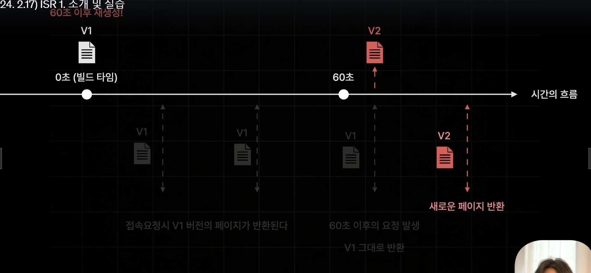

# 2.1) Page Router 를 소개합니다.
> 안정적인 라우터   
> React Router처럼 페이징 라우팅 기능을 제공함.

- pages 폴더를 기준으로 라우팅됨.
- 동적경로 ~/item/100 같은 페이지를 만드려면 폴더를 pages/item/[id].js  로 생성


- npx create-next-app@14 section02
- npm run dev

## 프로젝트 구조 확인
- public - 동적 파일
- src
  - pages : 경로에 맞는 페이지
  - styles

- _app.tsx : 모든 페이지의 부모역할을 하는 root 컴포넌트
  => layout이나 공통 비즈니스 로직을 작성할 수 있음.
- _document.tsx : 모든 페이지에 공통적으로 적용해야하는 html 코드 설정.
  => meta 태그, font, chracter set, Third party code
- next.config.mjs : next앱의 설정 관리

# 2.3) 페이지 라우팅 설정하기
- 페이지 라우팅 생성시
  - 방법 1 : search.tsx
  - 방법 2 : folder search > index.tsx
- 폴더 중첩 또는 해당 폴더에 경로명 파일을 생성하여 중첩된 페이징 라우팅이 가능.


## 동적 페이지 생성 및 동적 값 읽기
두 방식 동일하게 useRouter을 이용해서 query 객체에서 값을 읽을 수 있다.
```js
import { useRouter } from "next/router";
const router = useRouter();
const { q } = router.query;
```

### queryString 읽기
- import { useRouter } from "next/router";
- 기본 컴포넌트가 렌더링되고 queryString 을 이으면서 화면이 렌더링되기 때문에 두번 렌더링 된다. 따라서 두번째에 router 객체에 query 속성에 값을 읽어온다.


### URL Parameter
- ./book/100, ./book/200 과 같은 동적 페이지 생성시
  - book 폴더 하위에 [id].tsx 라는 파일을 생성하면 동적경로와 대응하게 됨.
  - [] 안에 있는 값이 키값이 되어 저장됨.
- ./book/123/4324
  - [...id].tsx 와 같이 파일을 생성한다.(Catch All Segment)
  - ... 는 여러개의 id가 들어갈 수 있다는 의미
  - router query 객체에는 배열형태로 저장되어있음.
- ./book 을 했을때는 404 not found 로 뜨게 됨 (url parameter을 무조건 받도록 해두었기 때문에)
  - [[...id]].jsx 와 같이 대괄호로 한번더 감싸주면 id가 있든 없든 대응이 가능하다. (Optional Catch All Segement)

## Not Found 페이지 만들기
- pages/404.tsx 파일 생성해서 기본 page 컴포넌트 리턴해주기.


# 2.3) 네비게이팅
```html
<a></a> # 기존의 a 태그는 csr 방식으로 페이지를 이동시키는 게 아니라
# html 일반적인 방식으로 페이지를 매번 새롭게 요청하는 방식으로 이동시키게 됨.
```
- next.js app => Link 컴포넌트 사용.
- csr 방식으로 페이지 이동하도록 구현
```js
import {useRouter} from "next/router";
router.push("/test")
```

# 2.4 프리패칭 Pre-fetching
사용자가 보고있는 페이지를 미리 불러오는 기능.
> Q. 왜 필요할까? 이미 Next js 는 CSR 으로 별도의 서버 요청없이 브라우져가 JS를 실행하여 컴포넌트를
> 교체하는 방식으로 페이지를 교체할 수 있는데.   
> A. 컴포넌트들을 각 페이지별로 slit 해서 가지고 있기때문임.

- **Js Bundle : 현재 페이지에 필요한 JS Bundle 만 전달된다.**
  - ex) "/search" 접속요청 -> Search JS Bundle
  - 만약 모든 페이지 번들파일을 전달할 경우 용량이 너무 커지게 되며 하이드레이션이 느려지게됨.   
    즉, 요청부터 사용자에게 보여지기까지의 시간인 TTI 가 느려지게됨.   
    -> 용량 경량화로 인해 Hydration 시간은 단축된다.

> Q. 그럼 다른 페이지 이동할때는 또 서버에서 js Bundle 가 필요하겠네?   
> A. 맞음. TTI는 빨라질수 있어도 페이지 이동이 느려질수 있음.    
그렇기 때문에 Pre-Fetching 사전에 미리 불러오는 기능을 사용함.

## 프리패칭이란?
초기접속 이후에 연결된 모든 페이지의 JS Bundle을 사전에 불러옴.
-> 페이지 이동이 빨라짐

즉 Js Bundle 후에 pre-fetching 후 페이지 이동 발생 시 컴포넌트만 교체하는 순으로 렌더링함.


하지만 npm run dev 상태에서는 이 기능이 동작안함.
- npm run build : 소스 빌드. 빌드 로그에서 각 페이지별 js Bundle 코드의 용량까지 확인 할 수 있음.
- npm run start : production 모드로 실행.

### pre-fetching 예외
- Link 컴포넌트로는 잘됨.
- 프로그래밍적으로? 페이지 이동을 구현해 놨을 경우 EX) button 으로 클릭시 했을 때는 안됨

### router 객체의 prefetch 이용하기
```js
  useEffect(() => {
  router.prefetch("/test")
}, []);
```
### 해제
```js
<Link href={'/search'} prefetch={false}>search</Link>

```

# 2.5) API Routes
Next.js 에서 API를 구축할 수 있게 해주는 기능

## API 정의
- pages > api > hello.ts => /api/hello 라는 api 경로로 작동됨.
- NextApiRequest, NextApiResponse 객체 사용   
  [API ROUTES 공식 문서](https://nextjs.org/docs/pages/building-your-application/routing/api-routes)


# 2.6) 스타일링
- app 컴포넌트가 아닌 다른 컴포넌트에서는 global css 바로 import 할 수없음
  => css class 충돌방지를 위해

## CSS Module
- index.module.css 로 import 후 객체에 담아서 페이지 별로 유니크하게 사용
```js
import style from "./index.module.css";

```

# 2.7) 글로벌 레이아웃 설정하기
- src > components > global-layout.tsx
  - APP 컴포넌트에 GlobalLayout 으로 감싸주기
  - global-layout.module.css import

```js
// global-layout.tsx
export default function GlobalLayout({children} : {
  children:ReactNode
}){
  return <>
```
```js
// _app.tsx
export default function App({Component, pageProps}: AppProps) {
  // Component : 페이지 역할
  // pageProps : 페이지에 전달할 Props
  return <>
    <GlobalLayout>
      <Component {...pageProps} />
```
- 레이아웃 컴포넌트에는 children 으로 APP 컴포넌트에서 전달하는 PageProps를 받을 수 있도록 함.

# 2.8) 페이지별 레이아웃 설정하기
- 요건 : 검색바는 전체 화면에서 존재하지만 도서 상세 화면에서만 적용되지 않아야함.
  => global 컴포넌트 말고 필요한 페이지에서 컴포넌트를 호출하기

- 구현 : 각 페이지에 getLayout 함수 전달해서 App 컴포넌트에 페이지 컴포넌트 렌더링 할때 getLayout 에 있는 컴포넌트로 감싸서 전달되도록 처리.
```js 
// 각 페이지 컴포넌트
Home.getLayout = (page: ReactNode) => {
  return <SearchableLayout>{page}</SearchableLayout>
}
```
- App컴포넌트에 Component 파라미터에 각 페이지 컴포넌트가 담겨있음. 그래서 각 페이지에 인수로 전달한 getLayout함수를 Component 객체로
  불러올 수 있음.
```js 
// app 컴포넌트
const getLayout = Component.getLayout;
return <>
  <GlobalLayout>
    {getLayout(<Component {...pageProps} />)}
```
- NextPage 타입 확장
```js
type NextPageWithLayout = NextPage & {
  getLayout?: (page: ReactNode) => ReactNode;  //  getLayout? : typescript 선택적 속성 (?) getLayout이 없는 페이지 때문에 옵셔널하게 처리
}
```
- AppProps 타입 확장
```js
export default function App({Component, pageProps}: AppProps & {
  Component : NextPageWithLayout
}) {

```
# 2.9) 한입 북스 UI 구현하기
- 책 상세 페이지 요건 : 책 상세는 id를 포함한 페이지이동만이 가능해야한다.
  - [[...id]].tsx => [id].tsx로 변경하기 : /book 이동 불가하고 /book/1/234/3 여러개 id불가능. /book/1 만 가능.


# 2.10) 사전 렌더링과 데이터 패칭

### React App 에서의 데이터 페칭
- 단점 : 초기 접속 요청부터 데이터 로딩까지 오랜 시간이 걸림.
  - 3번 과정에서 화면이 마운트 된 후에 요청이 들어가기 때문에.
```js
export default Page = () => {
  const [state, setState] = useState(); // 1. 불러온 데이터를 보관할 state 생성
  const fetchData = async () => { // 2. 데이터 패칭 함수 생성
    const response = await fetch("...");
    const data = await response.json();

    setState(data);
  }
  useEffect(() => { // 3. 컴포넌트 마운트 시점에 fetchData 호출
    fetchData();
  }, []);
  if(!state) return "loading..."; // 4. 데이터 로딩중일떄의 예외처리

  return <div>...</div>;
}

```


### Next App 에서의 데이터 페칭


> React App 의 데이터 패칭
>> - 컴포넌트 마운트 이후에 발생함.
>> - 데이터 요청 시점이 느려지게 되는 단점 발생.

> Next App 의 데이터 패칭
>> - **사전렌더링**중 발생함(당연히 컴포넌트 마운트 이후에도 발생가능)
>> - 데이터 요청 시점이 매우 빨라지는 장점이 있음.


### Next.js 의 다양한 사전 렌더링
| 렌더링 방식              | 설명                                                          | 장점                                                                                   | 단점                                                                  |
|--------------------------|---------------------------------------------------------------|----------------------------------------------------------------------------------------|----------------------------------------------------------------------|
| **서버사이드 렌더링 (SSR)** | - 요청 시마다 페이지를 사전 렌더링                                  | - 페이지 데이터를 항상 최신 상태로 유지 가능                                             | - 데이터 요청이 느리면 전체 페이지 렌더링이 지연됨                   |
| **정적 사이트 생성 (SSG)** | - 빌드 타임에 미리 페이지를 생성                                  | - 생성된 페이지를 즉시 응답하므로 빠른 로딩 속도                                          | - 항상 같은 페이지 응답, 최신 데이터 반영 어려움                    |
| **중분 정적 재생성 (ISR)** | - SSG의 단점을 보완한 사전 렌더링 방식                             | - 주기적으로 페이지를 업데이트하여 최신 데이터 반영 가능                                  | - 설정에 따라 최신 데이터가 실시간 반영되지 않을 수 있음             |

# 2.11) SSR(서버 사이드 렌더링) 소개 및 실습
```js
export const getServerSideProps = () => {
  // 1. 컴포넌트보다 먼저 실행되어서, 컴포넌트에 필요한 데이터 불러오는 함수
  // 2. 한번만 실행됨? 서버측에서 실행
  // window.location; 서버 스크립트 사용 불가능.
  console.log("서버사이드 프롭스");

  const data = "hello";
  return {
    props: { // props 객체를 리턴해주어야함.
      data,
    }
  }
}
export default function Home({data} : any) {

```
### index.tsx - Home 컴포넌트
1. 사전렌더링 - 서버 실행 2. 브라우저 js 번들 렌더링
- 모든 컴포넌트는 서버에서 한번 실행되기 때문에 그냥 클라이언트 코드를 작성하면 안됨.
  => useEffect 를 이용해서 화면 렌더링 후 호출되도록 하기.

### getServerSideProps 로 부터 props 데이터 전달받는 타입 정의
```js
export default function Home({data} : InferGetServerSidePropsType<typeof getServerSideProps>) { // Home 컴포넌트도 즉 객체이므로 getLayout 함수 추가 가능.

```


# 2.14) SSG 2. 정적 경로에 적용하기
- npm run build
  -  각 페이지별 렌더링 방식 확인 가능.

- GetStaticPropsContext -> queryString -> context.query 동작 불가 -> 빌드타임에 실행되기 때문.
  => 화면이 렌더링 된 이후에 클라이언트 측에서 queryString값을 읽어오도록 구현하기.

# 2.15) SSG 2. 동적 경로에 적용하기
동적인 경로를 가진 페이지를 SSG 렌더링을 적용하려면 getStaticPaths 를 함께 적용해주어야한다.

- book > [id].tsx 수정
  -  빌드타임(Build Time) 에 페이지별로 생성될 수 있는 페이지 경로를 설정해주어야함.
     => 1. n 개의 경로설정 (getStaticPaths) => 2. n개의 페이지 사전 렌더링
  - 확인
    - npm run build => book 동적경로가 정적파일로 생성된 내용을 확인 할 수 있음. 또한 .next 빌드 산출물 폴더에서 확인할 수 있음.


# 2.16)  SSG 4. 폴백 옵션 설정하기
> Fallback 옵션 설정 (없는 경로로 요청시)
> 1) false : 404 Not Found 반환
> 2) blocking : 즉시 생성 (Like SSR)
> 3) true : 즉시생성 + 페이지만 미리 반환(SSR + 데이터가 없는 폴백 상태의 페이지부터 반환)


### Fallback - blocking
- 요청 시 빌드 타임에 렌더링. 한번 실행 후 생성한 html 을 리턴함. (SSR + SSG)
  => 렌더링 중 지연되면 이후 순서도 지연됨.

### Fallback - true
- 요청 props 가 없는 페이지 변환(데이터가 없는 상태의 페이지 렌더링) -> props 계산
  -> props 만 따로 반환 -> 데이터가 있는 상태의 페이지 렌더링

```typescript
export const getStaticPaths : GetStaticPaths = () => {
  return {
    paths: [  // 렌더링 될 수있는 페이지 id 설정
      // url param은 무조건 string 으로 주어야함.
      {params: {id: "1"}},
      {params: {id: "2"}},
      {params: {id: "3"}}
    ],
    // 대체, 대비책 : paths 에 지정하지 않은 페이지 렌더링이요청됐을 때 어떻게 처리할것인지
    fallback : true,//"blocking", // false : path에 설정하지 않은 페이지는 not found 처리

  }

  export default function Page({bookDetail}: InferGetStaticPropsType<typeof getStaticProps>) {
    const router = useRouter();
    if(router.isFallback) return "로딩중입니다.";
    if (!bookDetail) return "문제가 발생했습니다. 다시 시도하세요.";
  ...
```


# 2.17) ISR 1. 소개 및 실습

## ISR이란?
ISR(Incremental Static Regeneration)
증분     정적     재생성
- SSG 방식으로 생성된 정적 페이지를 일정 시간을 주기로 다시 생성하는 기술.
- 장점 : 매우 빠른 속도로 응답가능(기존 SSG 방식의 장점) + 최신데이터 반영 가능(기존 SSR 방식의 장점)
## ISR 적용
- index.tsx 적용
  - 추천도서를 시간에 따라 달리 보여주게 하기 위해서 ISR 적용
  - getStaticProps 함수의 revalidate 옵션 설정
  - >> 새로고침 시 3초간격으로 새로운 데이터가 패칭되며 렌더링된다.

# 2.18) ISR 2. 주문형 재 검증

- 시간기반 ISR 을 적용하기 어려운 페이지도 존재함.
  - ex) 게시물상세 조회 화면에 적용했을 때 사용자가 게시글을 수정하지 않는이상 데이터 변경은 이루어   
    지지 않아도 데이터 패칭 및 렌더링이 발생함.
    => 시간과 관계없이 사용자의 행동에 따라 데이터가 업데이트 되는 페이지

## On-Demand-ISR
요청을 받을 때마다 페이지를 다시 생성하는 ISR


# 26. 2.19) SEO 설정하기
- favicon 변경
- meta 태그 설정
  - nextjs에서는 각페이지별로 meta태그를 적용해줄수 있음(react는 공통?)

## meta 태그 설정
1) Head 컴포넌트
2) meta 태그 property, content 프로퍼티값 설정
  - content = "/asdf" => / 는 public 를 가리킴

## SSG 방식에서 주의사항
ex) search / [id].tsx
- 빌드 타임에 미리 페이지를 생성하는 방식으로 fallback 옵션을 true로 했을 때
  - 미리 설정해둔 페이지 이외의 페이지를 요청하면    
    => 데이터 패치가 이루어지지않은 페이지만 렌더링 한다.
  - 때문에 meta태그를 데이터패치를 통해 조회해온 데이터를    
    가지고 설정하게 되면 데이터 패치가 이루어지기 전이기 때문에     
    meta 태그를 랜더링하지 않은 빈페이지를 렌더링한다.


# 27. 2.20) 배포하기
- vercel signup and login
- npm install -g vercel   
- vercel --prod

## Vercel
🔍 UI :  [Inspect](https://vercel.com/seungyeon-chas-projects/onbite-books-page/8BQsKJ8aKHR7hx4V69QLv4id7jHn)   
🔍 API :  [Inspect](https://vercel.com/seungyeon-chas-projects/onbite-books-server/2aWBtED2zLqsXQaLN9iLmV3NELkz)

## 환경변수
[Next.js-env환경-변수-정리](https://velog.io/@milkboy2564/Next.js-env%ED%99%98%EA%B2%BD-%EB%B3%80%EC%88%98-%EC%A0%95%EB%A6%AC)

# 28. 2.21) 페이지 라우터 정리
-- 테스트